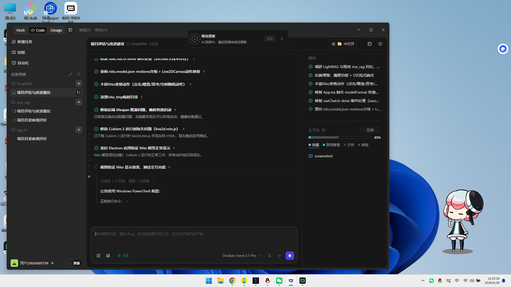

<div align="center">

# 🐾 GraphPet

**你的 AI 知识桌宠 —— 喂文件、学知识、陪你聊天**

[](https://www.electronjs.org/)
[](https://reactjs.org/)
[](https://www.python.org/)
[](https://github.com/HKUDS/LightRAG)
[](https://github.com/docling-project/docling)
[](LICENSE)

[功能特性](#-功能特性) · [快速开始](#-快速开始) · [使用指南](#-使用指南) · [技术架构](#-技术架构) · [开发说明](#-开发说明)



</div>

## ✨ 功能特性

### 🎀 可爱的 Live2D 桌宠 Nito
- **Nito 官方模型** —— 来自 Live2D 官网的经典 Cubism 4 模型，粉发少女萌力十足
- **五姐妹差分皮肤** —— Nito / Ni-J / Nico / Nietzsche / Nipsilon，一键切换
- **丰富表情动作** —— 21 组内置动作：开心、惊讶、生气、打哈欠、睡觉...
- **表情驱动** —— AI回复内容自动驱动表情（开心/惊讶/思考/伤心/生气）
- **智能互动** —— 摸头、戳身体会触发不同反应和台词
- **空闲随机动作** —— 没人理时会自己打哈欠、叹气、伸懒腰
- **状态联动** —— 思考时歪头、吃东西时开心、吃到坏文件会哭

### 🚀 零配置开箱即用
- **国内免费模式** —— 内置免费大模型聚合，打开就能聊天，不用注册不用装Ollama
- **多种 LLM 后端支持** —— 内置免费聚合 / 硅基流动 / 通义千问 / DeepSeek / 智谱GLM / Kimi / OpenAI / Ollama本地
- **自动故障转移** —— 一个API挂了自动切下一个，不中断对话

### 📚 知识图谱喂食（核心卖点）
- **拖放即喂** —— 把文件/URL 直接拖到 Nito 身上就能"喂"给她
- **Docling 文档解析** —— IBM 开源引擎，PDF / Word / 网页 → Markdown，支持复杂版面与表格
- **LightRAG 知识图谱** —— 港大 HKU EMNLP 2025 方案，自动抽取实体与关系，构建图谱
- **增量更新** —— 新文件只增量插入，不用全量重建知识图谱
- **文件级溯源** —— 每个文件的三元组单独存储，可查看详情、可"吐掉"删除
- **多格式支持** —— PDF、Word、TXT、Markdown、代码文件、网页 URL、图片

### 💬 智能聊天问答
- **独立聊天窗** —— 悬浮窗口，可拖动，不挡宠物
- **流式输出** —— SSE 实时流式响应，边想边说
- **多轮对话** —— 支持上下文记忆，连贯聊天不健忘
- **双模式问答**
  - **闲聊模式** —— 没喂文件也能日常聊天
  - **知识问答** —— 喂过文件后基于知识图谱回答，支持 local / global / hybrid 检索
- **一键新对话** —— 随时开始新话题

### 🔧 桌面级体验
- **窗口穿透** —— 平时鼠标穿透不影响工作，互动时自动响应
- **右键菜单** —— 右键 Nito 呼出菜单：聊天、喂文件、换皮肤、设置
- **气泡跟随** —— 对话气泡智能定位在头顶，不遮挡角色
- **数据本地** —— 所有数据存在本地，不上传云端，隐私安全
- **开机启动** —— 可设置开机自启
- **成长系统** —— 喂得越多越聪明，智力等级随知识增长

### 📊 管理面板
右键菜单 → "管理面板" 可打开 Web 面板：
- **📊 记忆图谱** —— SVG力导向图可视化知识实体和关系，支持缩放/拖拽/平移
- **📁 文件列表** —— 查看已喂的所有文件，点开查看三元组详情，可吐掉（删除）
- **📈 成长记录** —— 看 Nito 学会了多少东西
- **⏰ 时间线** —— 喂食与互动的完整历史
- **💬 深度对话** —— 完整聊天界面

## 🚀 快速开始

### 方式一：下载安装包（推荐普通用户）
前往 [Releases](https://github.com/graphpet/GraphPet/releases) 页面下载最新安装包：
- `GraphPet-x.x.x-setup.exe` —— 安装版（推荐）
- `GraphPet-x.x.x-portable.exe` —— 免安装便携版

安装后启动，在首启引导中选择 **"国内免费（零配置）"**，一键开始使用！

### 方式二：从源码运行（开发者）

**环境要求：**
- Windows 10/11（macOS/Linux 可自行适配）
- Node.js 18+（[下载](https://nodejs.org/)）
- Python 3.10+（[下载](https://www.python.org/downloads/)）

```bash
git clone https://github.com/graphpet/GraphPet.git
cd GraphPet

# 安装前端依赖
npm install

# 安装 Python 依赖
cd python
pip install -r requirements.txt
cd ..

# 启动开发模式
npm run dev
```

启动后首启引导选择 **"国内免费（零配置）"** 即可开箱即用。

> 💡 如果想用本地模型获得更好的隐私性和稳定性，可以安装 [Ollama](https://ollama.com/) 并拉取 `qwen2.5:7b` 模型，然后在设置中切换到本地模式。

### 打包发布
```bash
npm run dist:win     # Windows 安装包
npm run dist:mac     # macOS DMG
npm run dist:linux   # Linux AppImage
# 产物在 release/ 目录
```

## 📖 使用指南

### 基础互动
| 操作 | 效果 |
|------|------|
| **左键点击 Nito** | 戳她一下，会有可爱反应 |
| **摸头**（点击上半部分） | 摸头杀！她会害羞开心 |
| **右键 Nito** | 呼出功能菜单 |
| **拖文件到 Nito 身上** | 喂文件！她会学习里面的知识 |

### 喂文件
1. **拖放喂食** —— 直接把 PDF/Word/TXT/MD 等文件拖到 Nito 身上
2. **右键喂文件** —— 右键菜单 → "喂文件"，可批量选择
3. **喂 URL** —— 右键菜单 → "喂网页"，输入文章/博客链接
4. **喂完后** —— Nito 会开心地吃东西，吃完告诉你学了多少新东西

> ⏳ 大文件（PDF/Word）喂食时需要调用LLM抽取实体，可能需要1-3分钟，请耐心等待。

### 聊天
1. **右键 Nito** → "聊天" 打开聊天窗口
2. 输入问题按回车发送，Shift+Enter 换行
3. 知识类问题会自动检索你喂过的文件
4. 点 **+ 新对话** 清空当前对话

### LLM 后端配置
在设置中可以切换不同的 LLM 后端：

| 模式 | 需要注册 | 需要安装 | 说明 |
|------|---------|---------|------|
| 🚀 国内免费 | ❌ | ❌ | 默认推荐，内置免费API聚合，开箱即用 |
| ☁️ 硅基流动 | ✅ 免费注册 | ❌ | Qwen2.5-7B永久免费，注册送2000万Token |
| ☁️ 智谱GLM | ✅ 免费注册 | ❌ | GLM-4-Flash永久免费 |
| ☁️ 通义千问 | ✅ 免费注册 | ❌ | qwen-turbo有免费额度 |
| ☁️ DeepSeek | ✅ | ❌ | 新用户送500万Token，推理能力强 |
| ☁️ Kimi | ✅ | ❌ | 新用户送15元额度 |
| 🏠 Ollama本地 | ❌ | ✅ | 完全离线，数据不出本机 |

### 换皮肤
右键 Nito → "换皮肤"，可选择 Nito 五姐妹：
- **Nito**（尼托）—— 大姐，温柔体贴
- **Ni-J**（妮J）—— 二姐，冷静理性
- **Nico**（妮可）—— 三姐，活泼开朗
- **Nietzsche**（妮采）—— 四姐，深沉内敛
- **Nipsilon**（妮普西隆）—— 小妹，古灵精怪

## 🏗 技术架构

```
┌─────────────────────────────────────────────────────────┐
│                     Electron 主进程                      │
│  ┌─────────────┐  ┌─────────────┐  ┌─────────────────┐  │
│  │ 窗口管理     │  │ IPC 通信    │  │ Python 子进程   │  │
│  │ (宠物/聊天/  │  │ (桥接前后端) │  │ (FastAPI 后端)  │  │
│  │  面板)      │  │             │  │                 │  │
│  └─────────────┘  └─────────────┘  └────────┬────────┘  │
└──────────────────────────────────────────────┼───────────┘
                                               │
┌──────────────────────────────────────────────┼───────────┐
│              React 渲染进程                   │           │
│  ┌─────────────┐  ┌─────────────┐  ┌────────▼────────┐  │
│  │ PIXI.js     │  │ 聊天面板    │  │ FastAPI HTTP    │  │
│  │ Live2D 渲染 │  │ SSE 流式    │◄─┤ /chat/stream    │  │
│  │ (Cubism 4)  │  │ 气泡/菜单   │  │ /feed           │  │
│  └─────────────┘  └─────────────┘  │ /memory/*       │  │
│                                    └────────┬────────┘  │
└──────────────────────────────────────────────┼───────────┘
                                               │
                        ┌──────────────────────┼───────────┐
                        │      Python 后端      │           │
                        │  ┌────────────────────▼────────┐  │
                        │  │  graphpet_rag_bridge.py     │  │
                        │  │  ┌─────────┐ ┌────────────┐ │  │
                        │  │  │ Docling │ │  LightRAG  │ │  │
                        │  │  │文档解析 │ │ 知识图谱RAG│ │  │
                        │  │  └─────────┘ └────────────┘ │  │
                        │  │  ┌─────────────────────────┐ │  │
                        │  │  │ sentence-transformers   │ │  │
                        │  │  │ (BGE-small-zh embedding)│ │  │
                        │  │  └─────────────────────────┘ │  │
                        │  │  ┌─────────────────────────┐ │  │
                        │  │  │ FreeLLM Router（内置）   │ │  │
                        │  │  │ 免费API聚合·自动故障转移 │ │  │
                        │  │  └─────────────────────────┘ │  │
                        │  └─────────────────────────────┘  │
                        └──────────────────────────────────┘
```

### 技术栈
| 层级 | 技术 | 说明 |
|------|------|------|
| **桌面框架** | Electron 31 | 跨平台桌面应用 |
| **前端 UI** | React 18 + TypeScript | 类型安全的组件化开发 |
| **2D 渲染** | PIXI.js 6 + pixi-live2d-display | Live2D Cubism 4 模型渲染 |
| **构建工具** | electron-vite | 快速的 Electron Vite 构建 |
| **后端** | Python 3.10+ + FastAPI | 异步高性能 API 服务 |
| **文档解析** | Docling（IBM Research） | PDF/Word/网页 → Markdown，支持复杂版面与表格 |
| **知识图谱** | LightRAG（港大 HKU，EMNLP 2025） | 自动实体抽取 + 图谱 RAG 双层检索 |
| **Embedding** | sentence-transformers + BGE-small-zh | 512 维中文向量，本地推理 |
| **大模型** | 内置免费聚合 / 云端API / Ollama本地 | 灵活切换，零配置开箱即用 |
| **流式传输** | SSE (Server-Sent Events) | 实时流式回答输出 |

## 🔨 开发说明

### 项目结构
```
GraphPet/
├── assets/
│   ├── icon.png                 # 应用图标
│   └── live2d/nito4/            # Nito 五姐妹 Live2D Cubism 4 模型
│       ├── nito/                # Nito（尼托）
│       ├── ni-j/                # Ni-J（妮J）
│       ├── nico/                # Nico（妮可）
│       ├── nietzsche/           # Nietzsche（妮采）
│       └── nipsilon/            # Nipsilon（妮普西隆）
├── python/
│   ├── server.py                # FastAPI 后端入口
│   ├── free_llm_router.py       # 内置免费LLM聚合路由器
│   ├── graphpet_rag_bridge.py   # Docling + LightRAG 桥接模块
│   ├── requirements.txt         # Python 依赖
│   └── graphpet_core/           # 核心业务模块
│       ├── memory.py            # 知识图谱记忆管理
│       ├── state.py             # 桌宠状态持久化
│       ├── growth.py            # 养成系统
│       ├── scheduler.py         # 主动对话调度
│       ├── knowledge_share.py   # 冷知识分享
│       └── personality.py       # 性格系统
├── freellmapi-cn/               # 独立的国内免费LLM聚合网关项目
├── src/
│   ├── main/index.ts            # Electron 主进程
│   ├── preload/index.ts         # IPC 预加载
│   └── renderer/src/
│       ├── App.tsx              # 桌宠主界面
│       ├── ChatWindowApp.tsx    # 独立聊天窗口
│       ├── components/          # UI 组件
│       ├── hooks/               # React Hooks
│       ├── panels/              # 管理面板
│       ├── services/            # API 服务
│       └── stores/              # 状态管理
├── screenshots/                 # 截图
├── .github/workflows/           # GitHub Actions CI/CD
├── package.json
└── LICENSE
```

### 开发命令
```bash
npm run dev          # 开发模式
npm run build        # 构建前端
npm run dist:win     # 打包 Windows 安装包
npm run dist:mac     # 打包 macOS DMG
npm run dist:linux   # 打包 Linux AppImage
```

### 独立项目：freellmapi-cn
[freellmapi-cn/](freellmapi-cn/) 是一个独立的国内免费LLM API聚合网关项目（Node.js），聚合了国内所有可用的免费大模型API为统一的OpenAI兼容接口，支持自动故障转移和健康检测。可独立部署使用，也被GraphPet作为参考实现。

## 📄 许可证

[MIT License](LICENSE)

## 🙏 致谢

- [Live2D](https://www.live2d.com/) —— Nito 官方模型
- [LightRAG](https://github.com/HKUDS/LightRAG) —— 港大 HKU 知识图谱 RAG
- [Docling](https://github.com/docling-project/docling) —— IBM Research 文档解析
- [Ollama](https://ollama.com/) —— 本地大模型运行时
- [Pollinations AI](https://pollinations.ai) —— 免费的AI生成API
- [pixi-live2d-display](https://github.com/guansss/pixi-live2d-display) —— Live2D WebGL 渲染
